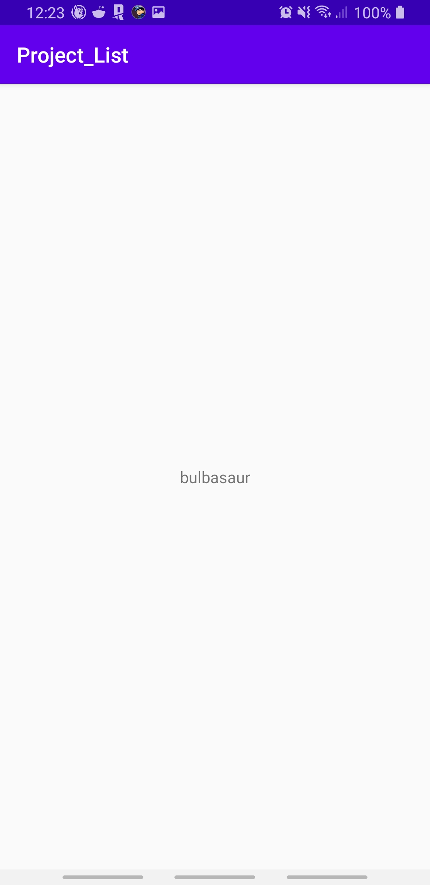

# Project_List
### Auteur : David Touitou
## Présentation
Réalisation dans le cadre d'un projet de 3ème année au sein de l'ESIEA d'une application mobile. Celle-ci affiche une liste de "pokémon", avec pour chacun d'entre eux, un deuxième écran affichant le sprite.

## Consignes respectées
- Une liste d'items utilisant une **recyclerView**
- Un **deuxième écran** pour chaque item affichant ses données
- Appel WebService à une **API Rest**
- Stockage des données en **cache**
- **Architecture** MVC et singletons

## Caractéristiques

### Ecran d'accueil avec la liste de pokémons.

### Ecran qui affiche les détails du pokémon choisi.

